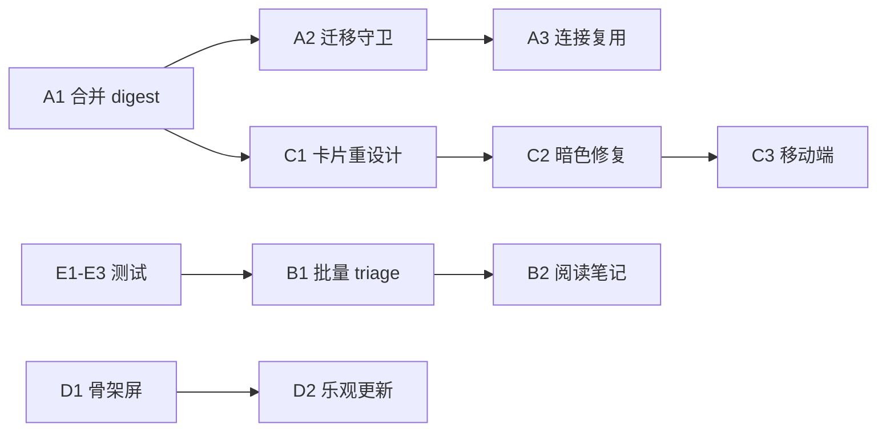

# arXiv Recommender 下一阶段优化方案

> 目标：交给 agent 逐步执行 | 基于 §3.6 Audit 修复后的代码状态

---

## §A 后端重构 (Backend Refactoring)

### A1. 合并 Digest 解析为单一入口

**现状**: Markdown digest 解析在 4 处重复实现，逻辑略有差异。

**修改范围**:
- 保留 `utils.py` 中的 `parse_markdown_digest()` 作为唯一实现
- 删除 `feedback_service.py:_parse_markdown_digest()` (L217-250)
- 删除 `inbox_viewmodel.py:_parse_markdown_digest()` (L496-610)
- 让所有调用方统一调用 `utils.parse_markdown_digest()`

**验收**: `grep -rn "_parse_markdown_digest" app/` 只返回 0 个结果；原有测试全部通过。

---

### A2. 迁移守卫：跳过已完成的 ID 规范化

**现状**: `state_store.py:_migrate_arxiv_paper_ids()` 每次启动扫全表。

**修改范围**:
- 在 `schema_meta` 表中存一个 `arxiv_id_migration_done` key
- `_migrate_arxiv_paper_ids()` 开头检查该 key，已完成则直接 return
- 首次完成迁移后写入 `schema_meta`

**文件**: [state_store.py](file:///Users/sunweizhou/Desktop/AI%20Project/arxiv_recommender/state_store.py) L280-376

**验收**: 第二次启动时 `_migrate_arxiv_paper_ids` 耗时 < 1ms（可用日志验证）。

---

### A3. SQLite 连接复用

**现状**: `_connect()` 每次创建新连接。

**修改方案**:
```python
# state_store.py — 用 threading.local() 做线程级连接缓存
import threading
_thread_local = threading.local()

def _connect(self):
    if not hasattr(_thread_local, 'conn') or _thread_local.conn is None:
        _thread_local.conn = sqlite3.connect(str(self._db_path), ...)
        _thread_local.conn.row_factory = sqlite3.Row
    return _thread_local.conn
```

**验收**: 在同一线程内多次调用 `_connect()` 返回同一个连接对象。

---

### A4. f-string 日志改为惰性格式化

**现状**: 几乎所有模块使用 `logger.info(f"...")`。

**修改范围**: 全局替换，优先处理高频路径：
- `daily_pipeline.py` — 循环内的 debug/info
- `subscription_runner.py` — 每个 subscription 执行时
- `feedback_service.py`

**规则**: `logger.info(f"Found {count} papers")` → `logger.info("Found %d papers", count)`

**验收**: `grep -rn 'logger\.\(info\|debug\|warning\|error\)(f"' app/` 返回 0 结果。

---

### A5. 清理空模块 + 废弃入口

| 操作 | 文件 |
|------|------|
| 删除空模块 | `app/models/__init__.py`, `app/repositories/__init__.py` |
| 将 `arxiv_recommender_v5.py` 的 re-export 改为 deprecation warning | `arxiv_recommender_v5.py` |
| 将 `from arxiv_recommender_v5 import X` 改为直接 import | 6 处调用点 |

---

## §B 功能增强 (Feature Enhancements)

### B1. 批量 Triage — Inbox 一键全部 Pass

**需求**: 用户处理完当天论文后，剩余未操作的论文应支持一键 "Pass All"。

**后端**:
- `app/routes/api/feedback.py` 新增 `POST /api/feedback/batch`
- 接受 `{"paper_ids": [...], "action": "dislike"}` 
- 调用 `feedback_service.handle_feedback()` 循环处理

**前端**:
- `today.html` 在论文列表底部增加按钮：
```html
<button class="btn btn-ghost" onclick="passAllRemaining()">Pass remaining papers</button>
```
- `inbox.js` 添加 `passAllRemaining()` 函数

**验收**: 点击按钮后所有未操作论文消失，页面显示空状态。

---

### B2. 论文详情页 — 阅读笔记

**需求**: `paper_detail.html` 侧边栏增加笔记区域，与 queue note 同步。

**后端**:
- 复用 `queue_service.update_status()` 的 note 参数
- `app/routes/api/paper.py` 新增 `POST /api/papers/<id>/note`

**前端**:
- `paper_detail.html` 右侧栏 Actions card 下方增加:
```html
<div class="card card-spaced">
  <h2 class="panel-title">Reading Notes</h2>
  <textarea id="paperNote" class="form-textarea" rows="6" 
            placeholder="记录你的想法..."></textarea>
  <button class="btn btn-sage btn-sm" onclick="savePaperNote()">Save</button>
</div>
```

**验收**: 笔记保存后在 Queue 页面同步可见。

---

### B3. 导出功能增强 — Collection → BibTeX 批量导出

**后端**:
- `app/routes/api/collections.py` 新增 `GET /api/collections/<id>/export/bibtex`
- 遍历 collection 中所有 paper_id，拼接 BibTeX

**前端**:
- `favorites_research.html` 每个 collection 项添加导出按钮

**验收**: 下载的 `.bib` 文件可被 Zotero/JabRef 正确导入。

---

### B4. 推荐健康度仪表盘 — Settings Diagnostics 增强

**需求**: 当前 diagnostics tab 信息过于简单。

**增加内容**:
| 指标 | 来源 |
|------|------|
| 最近 7 天推荐总数 | `list_recommendation_runs(limit=7)` |
| 平均论文分数 | 从 `recommendation_items` 聚合 |
| embedding 缓存命中率 | `get_all_embeddings_for_model()` 行数 |
| feedback model AUC | `get_feedback_model_auc()` |

**文件**: `app/viewmodels/settings_viewmodel.py` + `settings_research.html` diagnostics tab

---

## §C UI 精细化 (UI Polish)

### C1. Today 页论文卡片重设计

**现状**: 卡片只有标题+作者+摘要，信息密度低。

**改进**:
```
┌─────────────────────────────────────────────┐
│ [cs.LG] [stat.ML]              Score: 8.2  │
│                                              │
│ Paper Title Here                             │
│ Author A, Author B · 2026-04-30             │
│                                              │
│ 摘要前两行...                                │
│                                              │
│ 💡 匹配关键词: transformer theory, attention │
│                                              │
│ [Save]  [Skim Later]  [Deep Read]  [Pass]   │
└─────────────────────────────────────────────┘
```

**修改文件**:
- `today.html` — 增加 score 显示、日期、更多操作按钮
- `components.css` — `.paper-list-item` 增加 score chip 样式
- `inbox_viewmodel.py` — 确保 `reason_summary` 字段传递到模板

**具体改动**:
1. 卡片顶部添加 score chip: `<span class="score-chip">{{ "%.1f"|format(paper.score) }}</span>`
2. 显示 `paper.reason_summary` 而非 `recommendation_reason_blocks[0]`
3. 增加 "Skim Later" 和 "Deep Read" 按钮（目前只有 Save 和 Pass）
4. 将 `paper.published` 或 date 显示在作者行

---

### C2. 暗色模式 CSS 修复

**现状**: `tokens.css` 定义了 `[data-theme="dark"]` 变量，但多处硬编码颜色未适配。

**需要修复的硬编码**:
| 文件 | 位置 | 问题 |
|------|------|------|
| `components.css` | `.form-input` background | `rgba(255,255,255,0.74)` 在暗色下太亮 |
| `components.css` | `.detail-box` background | `rgba(248,242,230,0.72)` 未适配 |
| `components.css` | `.bulk-bar` background | `rgba(248,242,230,0.82)` 未适配 |
| `components.css` | `.relevance-item` background | 同上 |
| `pages.css` | 多处 hero 背景 | 硬编码暖色调 |

**修复方式**: 为这些元素添加 `[data-theme="dark"]` 覆盖规则，使用 `var(--bg-raised)` 或 `var(--bg-sunken)`。

---

### C3. 移动端响应式适配

**现状**: `--content-max-w: 640px` 过窄；`split` 布局在移动端未折叠。

**修改文件**: `layout.css` + `pages.css`

**新增媒体查询**:
```css
@media (max-width: 768px) {
  .split { flex-direction: column; }
  .rail, .aside-stack { order: -1; }
  .topbar-nav { overflow-x: auto; }
  .form-grid { grid-template-columns: 1fr; }
  .detail-actions-grid { grid-template-columns: 1fr; }
  .page-header { flex-direction: column; align-items: flex-start; }
}
```

---

### C4. 空状态视觉增强

**现状**: 空状态只有文字 + 一个链接按钮，缺少视觉吸引力。

**改进**: 在 `_components.html` 的 `empty_state` macro 中：
1. 将 emoji 放大显示为视觉焦点
2. 添加淡色背景卡片容器
3. 添加 `fadeSlideIn` 入场动画

```html

<div class="card empty-state-card" style="text-align:center; padding:48px 24px;">
    <div style="font-size:48px; margin-bottom:16px;">{{ icon }}</div>
    <h2 class="panel-title">{{ title }}</h2>
    <p class="muted-copy" style="max-width:360px; margin:8px auto 16px;">{{ desc }}</p>
    {{ action | safe }}
</div>

```

---

### C5. Toast 提示样式增强

**现状**: Toast 只有 success/error 两种状态。

**改进**:
- 添加 `warning` 和 `info` 样式
- Toast 自动消失时间从 2.2s 改为 3s（error 保持 5s）
- 添加关闭按钮
- 添加进度条动画

**文件**: `core.js` `showToast()` + `components.css` `.toast` 样式

---

### C6. Settings 页面 — 关键词权重可视编辑

**现状**: 关键词只能添加/删除，无法调整权重。

**改进**: 每个关键词 tag 旁显示权重滑块：
```html
<span class="keyword-tag-item" data-keyword="..." data-weight="3.0">
  transformer theory
  <input type="range" min="0.5" max="5.0" step="0.5" value="3.0" 
         class="keyword-weight-slider" onchange="updateKeywordWeight(this)">
  <span class="keyword-weight-label">3.0</span>
  <span class="keyword-tag-delete" onclick="deleteKeyword(this)">×</span>
</span>
```

**后端**: 复用 `POST /api/keywords` 的 `weight` 参数。

---

## §D 前端工程化 (Frontend Engineering)

### D1. 加载骨架屏

**需求**: 首页加载时显示骨架屏而非白屏。

**实现**: 在 `today.html` 的 `` 开头添加 CSS-only 骨架：
```html
<div class="skeleton-list" id="skeletonLoader">
  <div class="skeleton-card"></div>
  <div class="skeleton-card"></div>
  <div class="skeleton-card"></div>
</div>
```

**CSS** (添加到 `components.css`):
```css
.skeleton-card {
  height: 120px;
  border-radius: var(--r-lg);
  background: linear-gradient(90deg, var(--bg-sunken) 25%, var(--line-subtle) 50%, var(--bg-sunken) 75%);
  background-size: 200% 100%;
  animation: shimmer 1.5s infinite;
}
@keyframes shimmer {
  0% { background-position: 200% 0; }
  100% { background-position: -200% 0; }
}
```

---

### D2. 论文操作后的即时 UI 反馈

**现状**: 点击 Save/Pass 后需要等 fetch 完成才有反馈。

**改进**: 乐观更新 — 立即隐藏卡片，失败时回滚：
```javascript
// inbox.js — 改进 paper action handler
function handlePaperAction(paperId, action) {
  const card = document.querySelector(`[data-paper-id="${paperId}"]`);
  card.style.opacity = '0.3';
  card.style.pointerEvents = 'none';
  
  submitAction(paperId, action)
    .then(() => { card.remove(); })
    .catch(() => {
      card.style.opacity = '1';
      card.style.pointerEvents = '';
      showToast('操作失败，请重试', 'error');
    });
}
```

---

### D3. Command Palette 增强

**现状**: `command_palette.js` (17KB) 功能已较完整。

**增加命令**:
| 命令 | 动作 |
|------|------|
| `goto queue` | `window.location = '/queue'` |
| `goto settings` | `window.location = '/settings'` |
| `regenerate` | 调用 `confirmRefreshToday()` |
| `export all favorites` | 触发 BibTeX 批量导出 |

---

## §E 测试补全 (Test Coverage)

### E1. `build_recommendation_reason` 单元测试

**文件**: `tests/test_scoring_service.py` (新建或追加)

```python
def test_build_recommendation_reason_matched_topics():
    paper = {"title": "Transformer attention mechanisms", "abstract": "..."}
    profile = {"core_keywords": {"transformer": 3.0, "attention": 2.0}}
    result = build_recommendation_reason(paper, user_profile=profile)
    assert "transformer" in result["matched_topics"]
    assert result["reason_summary"]  # 非空

def test_build_recommendation_reason_empty_paper():
    result = build_recommendation_reason({}, user_profile={})
    assert result["reason_summary"] == "基于你的研究领域推荐"
```

### E2. `recover_stale_jobs` 集成测试

```python
def test_recover_stale_jobs(store):
    job = store.create_job("test", "manual", {}, status="running")
    # Manually backdate the updated_at
    with store._connect() as conn:
        conn.execute("UPDATE job_runs SET updated_at = datetime('now', '-3 hours') WHERE run_id = ?", (job["run_id"],))
    recovered = store.recover_stale_jobs(stale_after_minutes=120)
    assert recovered == 1
    assert store.get_latest_job("test")["status"] == "failed"
```

### E3. `trigger_source` 过滤测试

```python
def test_list_recommendation_dates_with_trigger_source(store):
    # Insert runs with different trigger_sources
    dates_auto = store.list_recommendation_dates(trigger_source="auto_homepage")
    dates_all = store.list_recommendation_dates()
    assert len(dates_all) >= len(dates_auto)
```

---

## 执行顺序建议



**推荐批次**:
1. **Batch 1** (低风险): A1 + A2 + A4 + E1-E3
2. **Batch 2** (UI): C1 + C2 + C4 + C5
3. **Batch 3** (功能): B1 + B2 + D2
4. **Batch 4** (工程): A3 + C3 + D1 + D3
5. **Batch 5** (增强): B3 + B4 + C6 + A5
